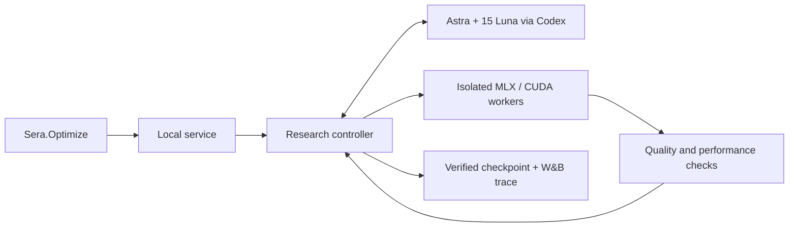

# SERA

### The autonomous auto-research harness for inference.

[](https://github.com/vvennela/weavehacks/actions/workflows/test.yml)
[](LICENSE)

[](https://wandb.ai/vvennela-n-a/wandb_agent_default_project)

**58% more inference throughput. 63% less allocator memory. 6.39 GiB of GPU memory freed.**

Get more inference from the hardware you already have. Describe your workload; Sera runs experiments, checks quality and performance, and returns a verified checkpoint. These are measured results from the workloads below.

## For reviewers

- **Resilience:** [recovery](tests/test_native_optimizer.py), [service cancellation and restart](tests/test_managed_service.py), [worker deadlines and cleanup](tests/test_native_worker.py), and [process ownership](tests/test_owned_command.py).
- **Tests and CI:** install [uv](https://docs.astral.sh/uv/), then run `bash check.sh`. This runs the full suite, lint, source and wheel builds, and package checks without live credentials or a GPU. [GitHub Actions](https://github.com/vvennela/weavehacks/actions/workflows/test.yml) runs the same checks on Linux and macOS; the badge above shows its status.
- **Architecture:** `Sera.Optimize` submits to an authenticated local service. Astra and 15 Luna specialists rank experiments; the Python controller runs isolated hardware workers and enforces quality and budget limits. A passing run returns a verified checkpoint and W&B trace. [Service](sera/managed_service.py) · [Controller](sera/native_optimizer.py) · [Agent board](sera/native_board.py).



**Review scope:** `sera/`, `tests/`, and the [release evidence index](evidence/README.md). CPU kernel modules are a separate research path. `src/sera_loop`, `experiments/`, notebooks, and the Molab website/deployment are labeled legacy; `sera_loop` remains installed and tested for existing callers. Working notes and old pitches are in [`docs/internal/`](docs/internal/).

## The numbers

The CUDA, summarization, extraction, classification, and RAG gains compare quantized inference with **the same model in BF16 on the same hardware and workload**. The 4B search comparison names both its fixed-recipe and BF16 baselines.

| Workload | Hardware | Measured result | Evidence |
| --- | --- | --- | --- |
| **Qwen3-8B · ModelOpt FP8** | NVIDIA L4 | **+57.63% output throughput**, **−36.81% p95 latency**, **−39.19% device memory**. **6.39 GiB freed.** | [Run](evidence/managed-cuda-release-v1/release.json) · [Throughput](evidence/managed-cuda-release-v1/throughput.json) |
| **Incident summarization · INT4** | M4 Pro · MLX · Qwen3-0.6B | **−63.33% allocator memory**, **+20.44% output throughput**. | [Run](evidence/managed-workloads-release-v1/release.json) |
| **Invoice extraction · INT4** | M4 Pro · MLX · Qwen3-0.6B | **−62.26% allocator memory**, **+25.99% output throughput**, **−29.81% p95 latency**. | [Run](evidence/managed-workloads-release-v1/release.json) |
| **Ticket classification · INT8** | M4 Pro · MLX · Qwen3-0.6B | **−39.82% allocator memory**, **+5.62% output throughput**. | [Run](evidence/managed-workloads-release-v1/release.json) |
| **RAG · 100,000 synthetic documents · INT8** | M4 Pro · MLX · Qwen3-0.6B | **−40.87% generator allocator memory**. All **13 acceptance + 24 independent holdout questions** passed. | [Run](evidence/managed-rag-release-v1/release.json) |
| **Qwen3-4B · search comparison** | M4 Pro · MLX | **−10.72% held-out allocator memory versus the fixed INT3 group-32 recipe**; **−74.84% versus BF16**. Both recipes passed the 20-question holdout. | [Paired study](evidence/native-mixed-search-qwen3-4b-v1/customer-result.json) |
| **FP32 CPU MatMul · panel32** | Apple M4 Pro · SME | **1,701.65 GFLOP/s observed peak**. | [Measurements](evidence/cpu-best-kernel-repeatability-2026-09-25/search/result.json) |
| **72B model deployment** | RTX PRO 6000 Blackwell | Served **Qwen2.5-72B in 86.38 GiB** of sampled GPU memory. | [Deployment](evidence/large-fit-v1/README.md) |

The latest classification, extraction, and summarization runs completed in **140–186 seconds**, passed every supplied check, exported checkpoints, and passed reload checks. The same model selected **INT8 for classification** and **INT4 for extraction**.

Throughput is generated tokens per second. CUDA memory is sampled whole-device usage; MLX memory is allocator peak. The native release comparisons use repeated candidate measurements and unchanged baseline controls. Quality is evaluated against each workload's supplied checks.

Earlier recorded serving result: **19.77% lower p95 latency** on eight repeated prompts. [Recording and trace](evidence/openai-example-v2/README.md).

## One setup. One call.

Use Python 3.11+ and Codex CLI. Setup can install Codex CLI through Node.js when needed.

```bash
python3 -m venv .venv
source .venv/bin/activate
pip install "git+https://github.com/vvennela/weavehacks.git"
sera setup
```

Setup installs the hardware runtime, connects your **Codex ChatGPT login**, registers models, quality checks and budgets, configures the operator's **W&B credentials**, and starts the local service. Credentials stay in private local files.

```python
import json
import sera

with open("checks.json") as file:
    checks = json.load(file)

result = sera.Optimize("Minimize memory for ticket classification", examples=checks)

with result.load() as model:
    answer = model.generate(
        checks[0]["prompt"], max_tokens=64, seed=0,
        response_format=checks[0]["response_format"])
    print(answer["text"])
```

Start with measured examples for [classification](examples/classification-checks.json), [extraction](examples/extraction-checks.json), or [plain-text summarization](examples/text-checks.json).

```bash
sera optimize "Minimize memory for ticket classification" --examples checks.json
sera status
sera stop
```

## What happens under the hood

- **Understand the workload.** Classification, extraction, chat, summarization, translation, and document question answering share the same inference research interface.
- **Research with a swarm.** Astra coordinates **15 Luna specialists**. They propose and rank experiments; Sera measures candidates and enforces acceptance checks.
- **Respect the request.** “Run at FP4” requires FP4. “Use the least memory” searches available precisions. Quality, speed, memory, and budget limits stay enforced. [Live intent checks](evidence/managed-workloads-release-v1/intent-contracts.json).
- **Use the hardware.** Native **MLX** on Apple Silicon; **NVIDIA ModelOpt** on CUDA.
- **Build RAG from documents.** Register a collection and pass `documents="manuals"` to index, retrieve, and optimize the answering model.
- **Deliver an artifact.** Verify and load the selected checkpoint. Every completed research run includes a verified **W&B trace**.

**Built to run:** authenticated local service, cancellation, hard deadlines, request recovery, checkpoint verification, and process cleanup. [Installed-package and CI checks](evidence/managed-workloads-release-v1/validation.json) · [Restart and recovery checks](evidence/managed-workloads-release-v1/lifecycle.json).

[Release status](docs/release.md) · [Demo workflow](docs/production-demo-workflow.md) · [Apache 2.0 license](LICENSE)
